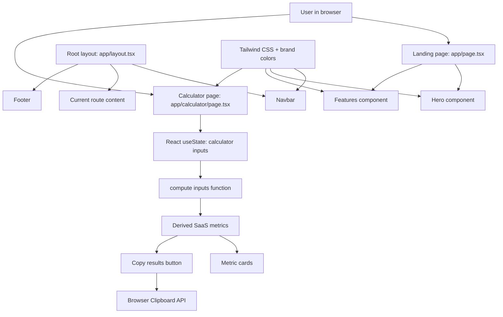
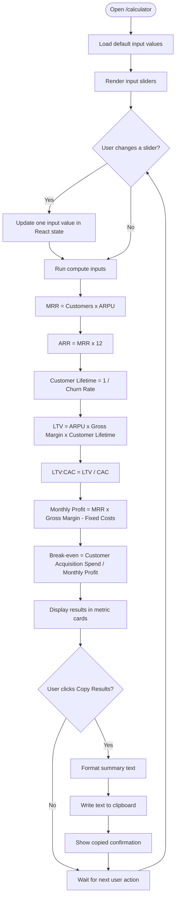

# SaaS Calculator

A clean, production-ready SaaS ROI calculator built with **Next.js 14**, **TypeScript**, and **Tailwind CSS**.

The app helps SaaS teams estimate recurring revenue, customer value, acquisition payback,
monthly profit, and break-even time. It runs fully in the browser, so no customer or
financial data is sent to a server.


---

## 1. Quick Start

### Local development

```bash
npm install
npm run dev
```

Open [http://localhost:3000](http://localhost:3000).

### Production build

```bash
npm run build
npm start
```

### Deploy to Vercel

1. Push this repo to GitHub.
2. Go to [vercel.com/new](https://vercel.com/new).
3. Import the GitHub repo.
4. Vercel auto-detects Next.js.
5. Click **Deploy**.

---

## 2. Main Features

- **Instant SaaS metrics**: MRR, ARR, LTV, CAC ratio, monthly profit, and break-even time.
- **Live sliders**: changing any input updates all outputs immediately.
- **Copy results**: one-click copy for sharing calculator results.
- **Responsive UI**: works on desktop, tablet, and mobile.
- **Dark mode support**: follows the user's system theme using Tailwind `dark:` styles.
- **No backend required**: all calculations happen in the browser.

---

## 3. System Architecture

This is a small static-style web application using the Next.js App Router. The calculator page is the only client-side interactive page.



### Architecture notes for the support team

- **Framework**: Next.js 14 with App Router.
- **Language**: TypeScript.
- **Styling**: Tailwind CSS with a custom `brand` color scale in `tailwind.config.js`.
- **Routes**:
  - `/` — marketing landing page.
  - `/calculator` — interactive SaaS calculator.
- **Server/backend**: none. The app does not call any API and does not store data.
- **Data privacy**: all input values stay in the user's browser.
- **State management**: local React `useState` only; no Redux, database, or remote state.
- **Calculation location**: `compute(inputs)` inside `app/calculator/page.tsx`.
- **Copy feature**: uses `navigator.clipboard.writeText` in the browser.

---

## 4. Pseudo Program Logic Diagram

The calculator follows a simple input → calculate → display flow.



### Pseudo code

```text
Start calculator page

Set default inputs:
  customers = 500
  arpu = 49
  churnRate = 5%
  cac = 300
  fixedCosts = 15000
  grossMargin = 80%

Whenever the page renders:
  mrr = customers * arpu
  annualRunRate = mrr * 12
  monthlyChurn = customers * churnRate%

  if churnRate > 0:
    customerLifetimeMonths = 1 / churnRate%
  else:
    customerLifetimeMonths = 999

  grossProfitPerCustomer = arpu * grossMargin%
  ltv = grossProfitPerCustomer * customerLifetimeMonths

  if cac > 0:
    ltvCacRatio = ltv / cac
  else:
    ltvCacRatio = 0

  monthlyGrossProfit = mrr * grossMargin%
  monthlyProfit = monthlyGrossProfit - fixedCosts

  if monthlyProfit <= 0:
    breakEvenMonths = 999
  else:
    breakEvenMonths = ceiling((customers * cac) / monthlyProfit)

Show all results to the user

If user clicks Copy Results:
  format result text
  copy text to browser clipboard
  show "Copied" for 2 seconds
```

---

## 5. Project Structure

```text
saas-calculator/
├── app/
│   ├── components/
│   │   ├── Navbar.tsx       # Responsive navigation
│   │   ├── Footer.tsx       # Site footer
│   │   ├── Hero.tsx         # Landing page hero section
│   │   └── Features.tsx     # Landing page feature cards
│   ├── calculator/
│   │   └── page.tsx         # Interactive calculator page and all formulas
│   ├── globals.css          # Tailwind imports and base styles
│   ├── layout.tsx           # Root layout, metadata, Navbar, Footer
│   └── page.tsx             # Landing page route
├── AGENTS.md                # Hermes Agent project rules
├── CLAUDE.md                # Claude Code project guidance
├── next.config.js           # Next.js config
├── package.json             # Scripts and dependencies
├── package-lock.json        # Locked dependency versions
├── postcss.config.js        # PostCSS config for Tailwind
├── tailwind.config.js       # Tailwind theme and brand colors
├── tsconfig.json            # TypeScript config
├── vercel.json              # Vercel deployment config
└── README.md                # Project handover guide
```

---

## 6. Calculator Formulas

| Metric | Formula | Plain-English meaning |
|---|---|---|
| MRR | `customers × ARPU` | Expected revenue each month from subscribed customers. |
| ARR | `MRR × 12` | Yearly revenue estimate based on current monthly revenue. |
| Monthly Churn | `customers × churnRate` | Estimated number of customers lost per month. |
| Customer Lifetime | `1 / monthlyChurnRate` | How many months a customer stays on average. |
| Gross Profit per Customer | `ARPU × grossMargin` | Revenue left per customer after direct service costs. |
| LTV | `grossProfitPerCustomer × customerLifetimeMonths` | Estimated profit value of one customer over their lifetime. |
| LTV:CAC | `LTV / CAC` | Whether customer value is higher than acquisition cost. |
| Monthly Profit | `(MRR × grossMargin) - fixedCosts` | Estimated profit after direct costs and fixed monthly expenses. |
| Break-even Months | `(customers × CAC) / monthlyProfit` | Estimated time to recover acquisition spend. |

### Special handling

- If churn rate is `0`, customer lifetime is set to `999` months to avoid division by zero.
- If CAC is `0`, LTV:CAC is shown as `0` to avoid division by zero.
- If monthly profit is `0` or negative, break-even is shown as not reached.

---

## 7. Simple User Manual

This section is for business users who are not financial specialists.

### What this app is for

Use this calculator to answer questions like:

- How much recurring revenue do we make each month?
- Is each customer worth more than it costs to acquire them?
- Are we profitable after normal monthly costs?
- How many months will it take to recover customer acquisition spending?

### How to use the calculator

1. Open the app.
2. Click **Open Calculator**.
3. Move the sliders under **Your Business**:
   - **Customers**: number of paying customers.
   - **ARPU**: average monthly revenue per customer.
   - **Monthly Churn Rate**: percentage of customers expected to cancel each month.
4. Move the sliders under **Costs**:
   - **CAC**: average cost to get one new customer.
   - **Monthly Fixed Costs**: monthly operating costs such as salaries, tools, hosting, and office cost.
   - **Gross Margin**: percentage of revenue left after delivering the service.
5. Read the result cards on the right side.
6. Click **Copy Results** if you want to paste the summary into email, chat, or a report.

### How to read the results

- **MRR**: higher is better. This is your monthly subscription revenue.
- **ARR**: useful for yearly planning and investor-style reporting.
- **LTV:CAC**:
  - Below `1x`: risky, because customer value is lower than acquisition cost.
  - Around `1x` to `3x`: acceptable but should be monitored.
  - `3x` or higher: generally healthy for many SaaS businesses.
- **Monthly Profit**:
  - Positive number means the model is profitable based on the current assumptions.
  - Negative number means the model is losing money based on the current assumptions.
- **Break-even**:
  - Shorter is better.
  - `—` means break-even is not reached because monthly profit is zero or negative.

### Important note

This app is an estimate tool. It is not accounting software. Actual business results can
differ because of discounts, refunds, taxes, payment fees, one-time revenue, annual
plans, and customer behavior changes.

---

## 8. Business Term Glossary

| Term | Meaning for non-financial users |
|---|---|
| SaaS | Software as a Service. Customers pay to use software, usually monthly or yearly. |
| Customer | A paying account or subscriber. In this app, one customer equals one paying subscription. |
| ARPU | Average Revenue Per User. The average amount one customer pays per month. |
| MRR | Monthly Recurring Revenue. Subscription revenue expected every month. |
| ARR | Annual Run Rate. MRR multiplied by 12 to estimate yearly recurring revenue. |
| Churn | Customers who cancel or stop paying. High churn means customers leave quickly. |
| Churn Rate | The percentage of customers that cancel each month. |
| CAC | Customer Acquisition Cost. Average money spent to win one new customer, including ads, sales, and marketing. |
| Gross Margin | Percentage of revenue left after direct service delivery costs. For SaaS, this can include hosting, support, and payment processing. |
| LTV | Lifetime Value. Estimated total gross profit from one customer before they cancel. |
| LTV:CAC Ratio | Comparison between customer lifetime value and acquisition cost. Higher means acquisition spending is more efficient. |
| Fixed Costs | Monthly costs that do not change much when customer count changes, such as salaries, subscriptions, rent, and basic infrastructure. |
| Monthly Profit | Estimated profit each month after gross margin and fixed costs. |
| Break-even | The point where accumulated profit has recovered the money spent to acquire customers. |
| ROI | Return on Investment. A general way to ask whether money spent creates enough return. |

---

## 9. Developer Handover Notes

### Common change requests

- **Change default values**: edit `defaultInputs` in `app/calculator/page.tsx`.
- **Change formulas**: edit the `compute(inputs)` function in `app/calculator/page.tsx`.
- **Change slider ranges**: edit each `Slider` component usage in `CalculatorPage`.
- **Change result labels or hints**: edit the `Metric` components in `CalculatorPage`.
- **Change branding colors**: edit the `brand` colors in `tailwind.config.js`.
- **Change global metadata**: edit `app/layout.tsx`.
- **Change landing page content**: edit `app/components/Hero.tsx` and `app/components/Features.tsx`.

### Development workflow

```bash
npm install
npm run dev
npm run build
```

There is currently no automated test suite. Before handover or release, at minimum run:

```bash
npm run build
```

Then manually verify:

1. `/` loads correctly.
2. `/calculator` loads correctly.
3. Moving each slider updates the results.
4. **Copy Results** copies readable text to the clipboard.
5. The page works on a mobile-width screen.
6. Dark mode styles remain readable.

### Git workflow for agents and support developers

This repository includes `AGENTS.md`. Follow the project rule: create a feature branch
for changes, commit there, and only merge to `master` after explicit approval or
instruction.

---

## 10. License

MIT
